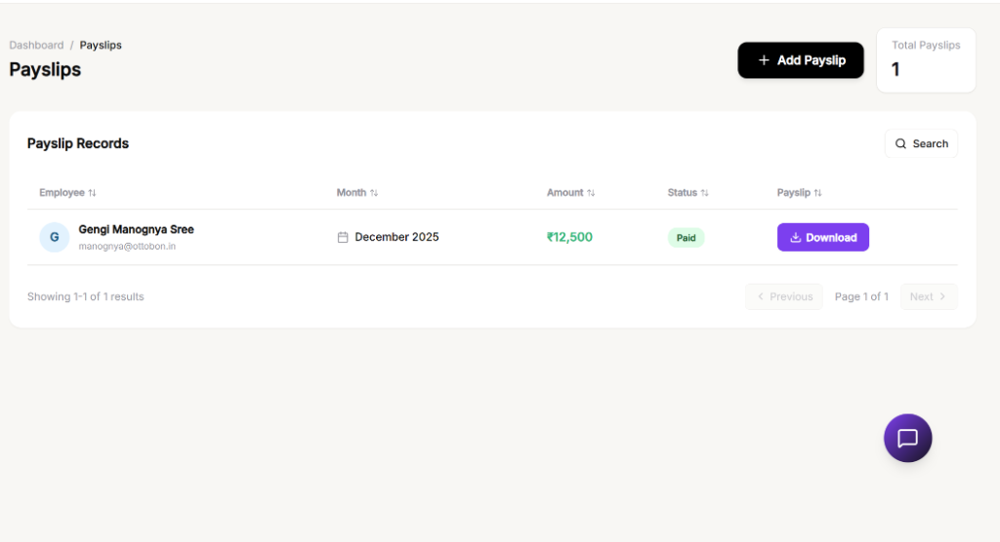
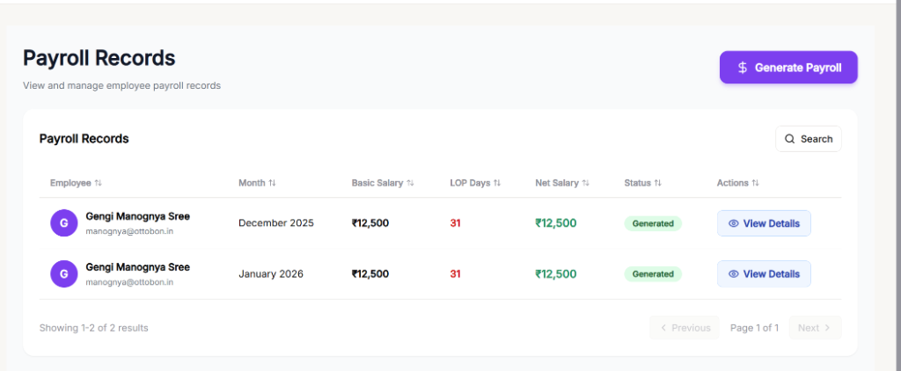
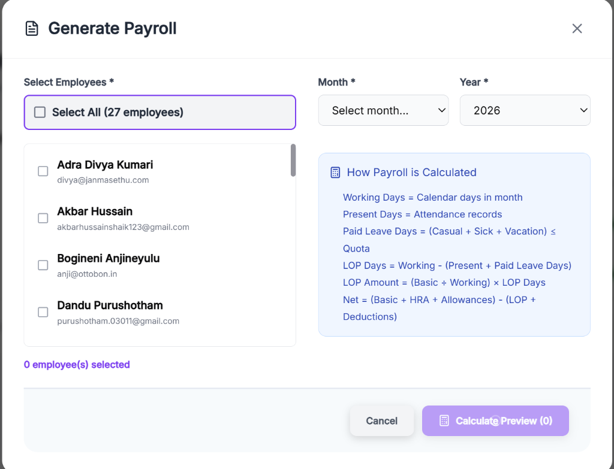
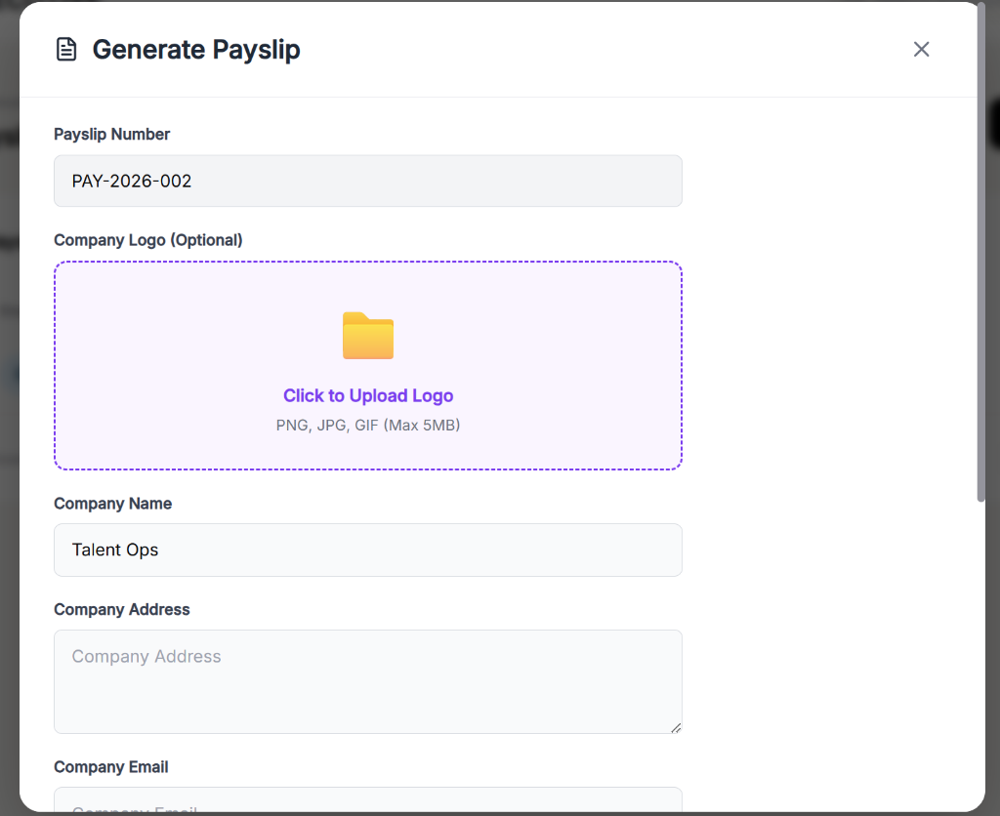
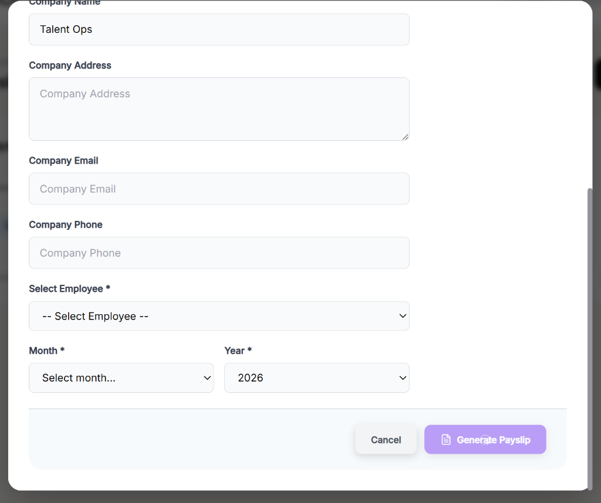
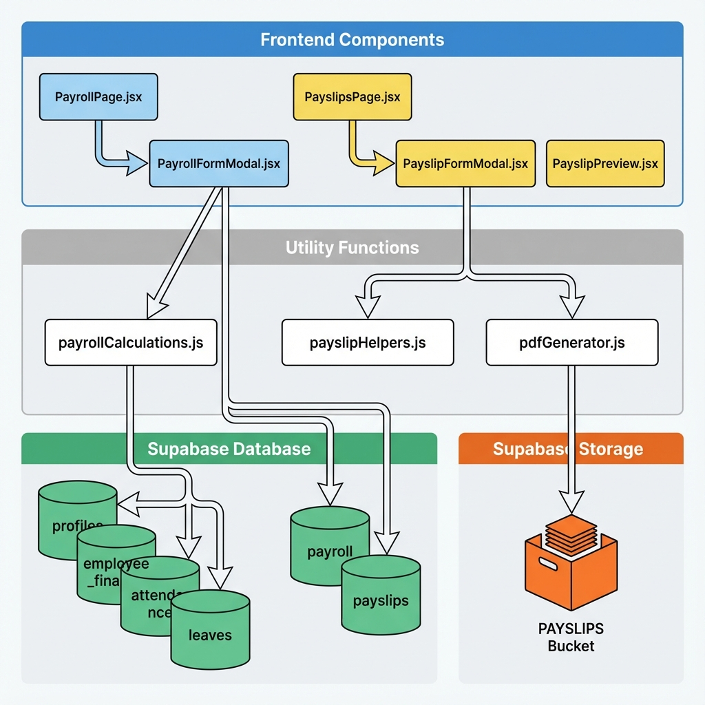
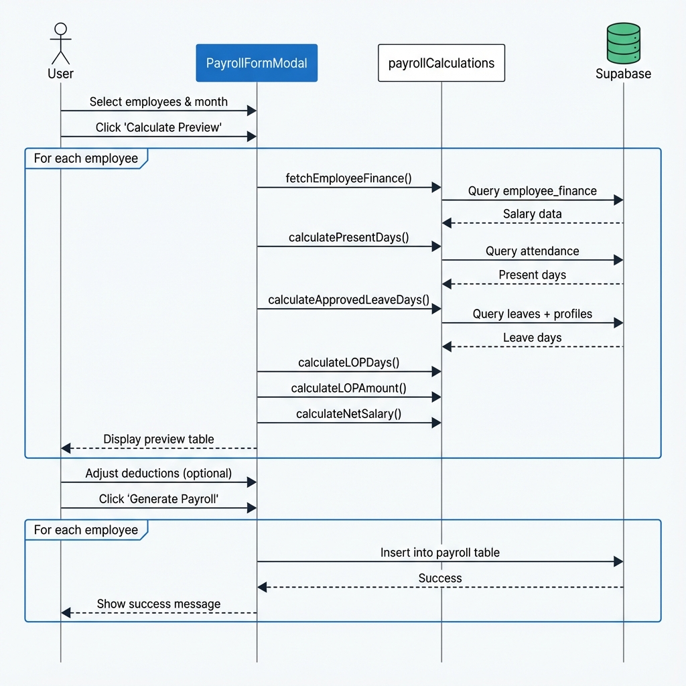
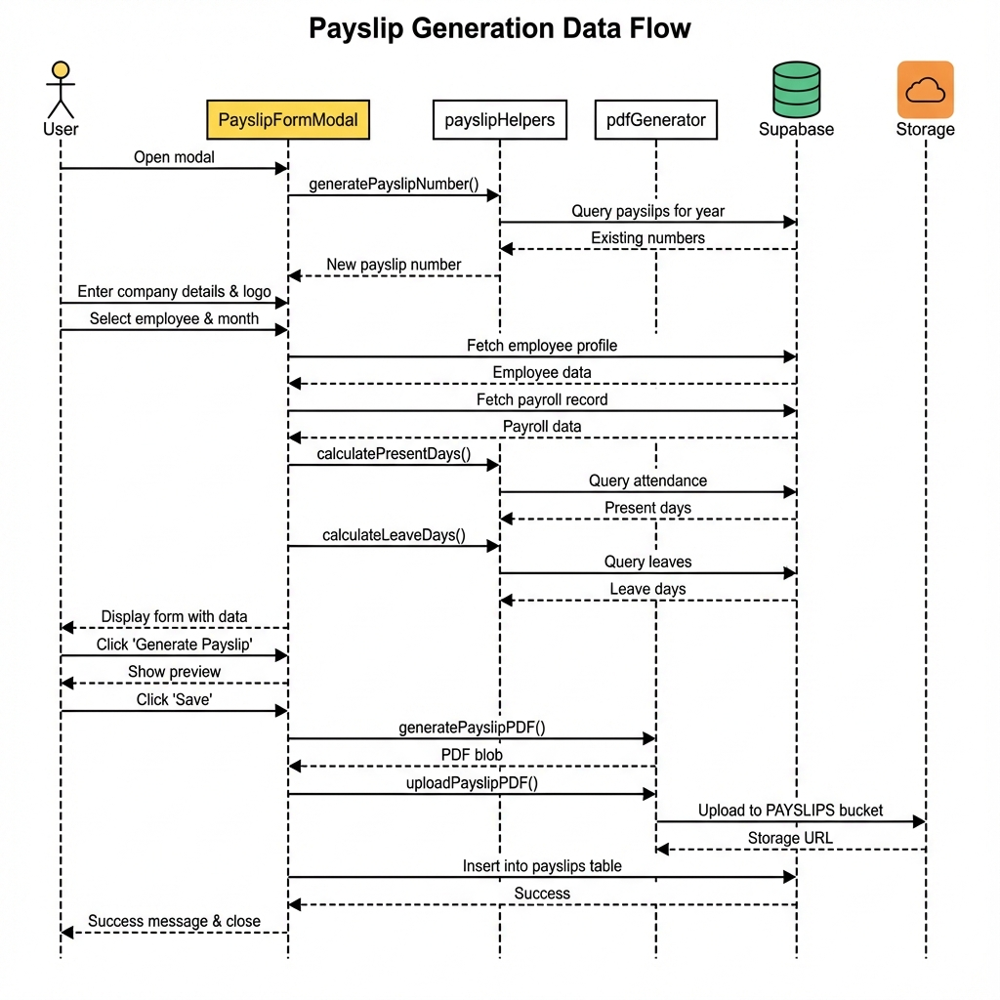
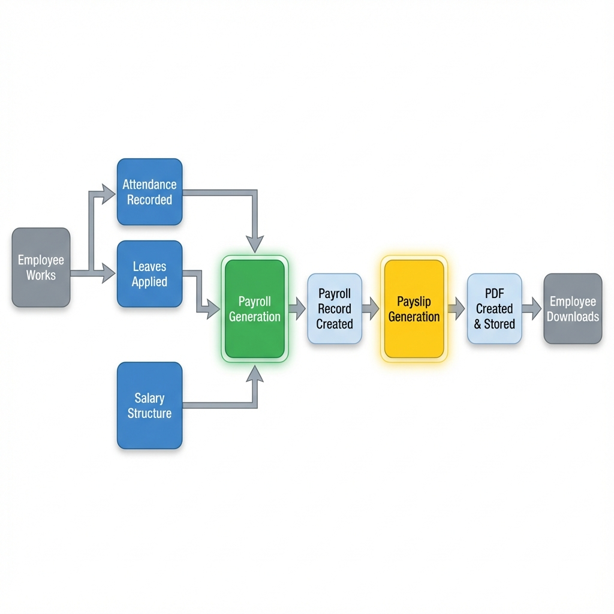
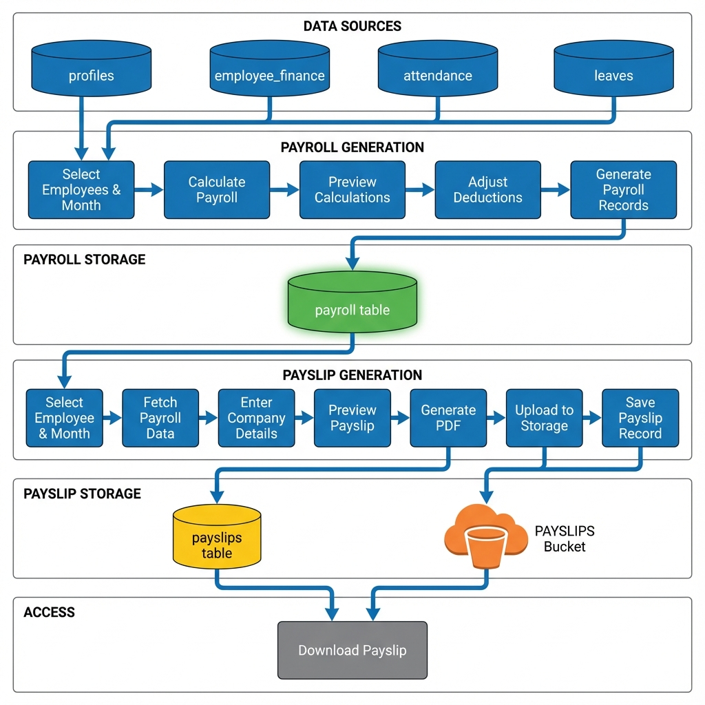

# Payroll & Payslip Module Documentation

## Table of Contents
1. [Overview](#overview)
2. [Screenshots](#screenshots)
3. [System Architecture](#system-architecture)
4. [Database Schema](#database-schema)
5. [Payroll Module](#payroll-module)
6. [Payslip Module](#payslip-module)
7. [Module Relationship](#module-relationship)
8. [Data Flow](#data-flow)

---

## Overview

The Talent Ops system includes two interconnected modules for managing employee compensation:

- **Payroll Module**: Calculates and generates monthly salary records based on attendance, leaves, and financial data
- **Payslip Module**: Creates downloadable PDF payslips from payroll records with company branding

These modules work together to automate the complete salary processing workflow from calculation to document generation.

---

## Screenshots

````carousel

<!-- slide -->

<!-- slide -->

<!-- slide -->

<!-- slide -->

````

---

## System Architecture



---

## Database Schema

### Tables Used

#### 1. `profiles`
Stores employee basic information.

| Column | Type | Description |
|--------|------|-------------|
| `id` | UUID | Primary key (employee ID) |
| `full_name` | TEXT | Employee full name |
| `email` | TEXT | Employee email |
| `role` | TEXT | Employee role/designation |
| `location` | TEXT | Employee location |
| `monthly_leave_quota` | INTEGER | Monthly paid leave quota (default: 3) |

#### 2. `employee_finance`
Stores active salary structure for each employee.

| Column | Type | Description |
|--------|------|-------------|
| `id` | UUID | Primary key |
| `employee_id` | UUID | Foreign key → profiles.id |
| `basic_salary` | NUMERIC | Basic salary amount |
| `hra` | NUMERIC | House Rent Allowance |
| `allowances` | NUMERIC | Other allowances |
| `is_active` | BOOLEAN | Active salary record flag |

#### 3. `attendance`
Daily attendance records.

| Column | Type | Description |
|--------|------|-------------|
| `id` | UUID | Primary key |
| `employee_id` | UUID | Foreign key → profiles.id |
| `date` | DATE | Attendance date |
| `clock_in` | TIMESTAMP | Clock-in time |
| `clock_out` | TIMESTAMP | Clock-out time |

#### 4. `leaves`
Leave application records.

| Column | Type | Description |
|--------|------|-------------|
| `id` | UUID | Primary key |
| `employee_id` | UUID | Foreign key → profiles.id |
| `from_date` | DATE | Leave start date |
| `to_date` | DATE | Leave end date |
| `reason` | TEXT | Leave type (Casual, Sick, Vacation, Loss of Pay) |
| `status` | TEXT | Approval status (approved, pending, rejected) |

#### 5. `payroll`
Generated monthly payroll records.

| Column | Type | Description |
|--------|------|-------------|
| `id` | UUID | Primary key |
| `employee_id` | UUID | Foreign key → profiles.id |
| `month` | TEXT | Month-Year (e.g., "December 2025") |
| `basic_salary` | NUMERIC | Basic salary for the month |
| `hra` | NUMERIC | HRA for the month |
| `allowances` | NUMERIC | Allowances for the month |
| `deductions` | NUMERIC | Additional deductions |
| `lop_days` | INTEGER | Loss of Pay days |
| `net_salary` | NUMERIC | Final calculated salary |
| `generated_by` | UUID | User who generated the payroll |
| `status` | TEXT | Payroll status (generated) |
| `created_at` | TIMESTAMP | Creation timestamp |

#### 6. `payslips`
Generated payslip documents.

| Column | Type | Description |
|--------|------|-------------|
| `id` | UUID | Primary key |
| `payslip_number` | TEXT | Unique payslip number (PAY-YYYY-NNN) |
| `employee_id` | UUID | Foreign key → profiles.id |
| `month` | TEXT | Month-Year (e.g., "December 2025") |
| `amount` | NUMERIC | Net salary amount |
| `storage_url` | TEXT | Supabase storage URL for PDF |
| `created_by` | UUID | User who generated the payslip |
| `status` | TEXT | Payslip status (generated) |
| `created_at` | TIMESTAMP | Creation timestamp |

### Storage Buckets

#### `PAYSLIPS`
Stores generated payslip PDF files.

**Path Structure**: `{employee_id}/{payslip_number}.pdf`

**Example**: `a1b2c3d4-e5f6-7890-abcd-ef1234567890/PAY-2026-001.pdf`

---

## Payroll Module

### Purpose
Automates monthly salary calculation based on attendance, leaves, and salary structure.

### Key Components

#### 1. **PayrollPage.jsx**
Main display page for payroll records.

**Features:**
- Lists all generated payroll records in a data table
- Displays employee name, month, basic salary, LOP days, net salary, and status
- "View Details" modal showing complete salary breakdown
- "Generate Payroll" button (Executive/Manager only)
- Real-time updates via Supabase subscriptions

**Role-Based Access:**
- **Executive/Manager**: Can view all payrolls and generate new ones
- **Employee/Team Lead**: Can view all payrolls (read-only)

#### 2. **PayrollFormModal.jsx**
Modal for generating payroll for multiple employees.

**Workflow:**
1. **Employee Selection**: Select one or multiple employees (or "Select All")
2. **Month/Year Selection**: Choose the payroll period
3. **Calculate Preview**: System calculates payroll for each employee
4. **Review & Adjust**: Preview shows calculations with editable additional deductions
5. **Generate**: Inserts records into `payroll` table

**Features:**
- Multi-employee batch processing
- Real-time calculation preview
- Editable additional deductions per employee
- Progress indicator during generation
- Duplicate detection (prevents re-generating existing payroll)
- Warning messages for employees without salary data

#### 3. **payrollCalculations.js**
Core calculation utility functions.

**Key Functions:**

##### `getDaysInMonth(month, year)`
Returns total calendar days in a month.

##### `calculatePresentDays(employeeId, month, year)`
- Queries `attendance` table for the specified month
- Counts unique dates with both `clock_in` and `clock_out`
- Returns total present days

##### `calculateApprovedLeaveDays(employeeId, month, year)`
- Queries `leaves` table for approved leaves
- Filters out "Loss of Pay" leaves
- Counts Casual, Sick, and Vacation leaves
- Caps at `monthly_leave_quota` from `profiles` table
- Returns paid leave days

##### `calculateLOPDays(totalWorkingDays, presentDays, leaveDays)`
```
LOP Days = Total Working Days - (Present Days + Paid Leave Days)
```

##### `calculateLOPAmount(basicSalary, totalWorkingDays, lopDays)`
```
Per Day Salary = Basic Salary ÷ Total Working Days
LOP Amount = Per Day Salary × LOP Days
```

##### `calculateNetSalary(basicSalary, hra, allowances, additionalDeductions, lopAmount)`
```
Gross Salary = Basic + HRA + Allowances
Total Deductions = Additional Deductions + LOP Amount
Net Salary = Gross Salary - Total Deductions
```

##### `checkPayrollExists(employeeId, monthYear)`
Checks if payroll already exists to prevent duplicates.

##### `formatMonthYear(month, year)`
Converts numeric month to "Month YYYY" format (e.g., "December 2025").

### Payroll Calculation Formula

```
Working Days = Calendar days in month
Present Days = Attendance records
Paid Leave Days = (Casual + Sick + Vacation) ≤ Quota
LOP Days = Working - (Present + Paid Leave Days)
LOP Amount = (Basic ÷ Working) × LOP Days
Net = (Basic + HRA + Allowances) - (LOP + Deductions)
```

### Data Flow



---

## Payslip Module

### Purpose
Generates professional PDF payslips from payroll records with company branding.

### Key Components

#### 1. **PayslipsPage.jsx**
Main display page for payslip records.

**Features:**
- Lists all payslip records in a data table
- Displays employee name, month, amount, status, and download button
- "Add Payslip" button (Executive/Manager only)
- Download functionality for PDF payslips
- Real-time updates via Supabase subscriptions

**Role-Based Access:**
- **Executive/Manager**: Can view all payslips and generate new ones
- **Employee/Team Lead**: Can view only their own payslips

**Download Process:**
1. Extracts file path from `storage_url`
2. Downloads blob from Supabase `PAYSLIPS` bucket
3. Creates temporary download link
4. Triggers browser download with formatted filename

#### 2. **PayslipFormModal.jsx**
Modal for generating individual payslips.

**Workflow:**
1. **Company Details**: Enter company name, address, email, phone, and upload logo
2. **Employee Selection**: Choose employee
3. **Month/Year Selection**: Choose payslip period
4. **Auto-fetch Data**: System fetches payroll data and attendance
5. **Preview**: Shows complete payslip preview
6. **Generate**: Creates PDF and saves to database

**Features:**
- Auto-generated unique payslip number (PAY-YYYY-NNN)
- Company logo upload with preview
- Real-time payroll data fetching
- Salary breakdown display
- Attendance summary
- PDF preview before saving
- Integration with Payroll module (can create missing payroll)

#### 3. **PayslipPreview.jsx**
Preview component showing the payslip before PDF generation.

**Features:**
- Professional payslip layout preview
- Company branding display
- Complete salary breakdown
- Attendance details
- "Save" button to generate PDF

#### 4. **payslipHelpers.js**
Utility functions for payslip operations.

**Key Functions:**

##### `generatePayslipNumber()`
- Queries all payslips for current year
- Finds maximum number
- Generates next sequential number (PAY-YYYY-NNN)
- Ensures uniqueness

##### `calculatePresentDays(employeeId, month, year)`
Similar to payroll calculation but specific to payslip context.

##### `calculateLeaveDays(employeeId, month, year)`
Calculates total approved leave days overlapping with the month.

##### `formatMonth(month, year)`
Returns "YYYY-MM" format for database storage.

##### `formatMonthDisplay(monthString)`
Converts "YYYY-MM" to "Month YYYY" for display.

#### 5. **pdfGenerator.js** (Referenced but not shown)
Handles PDF generation and upload.

**Key Functions:**

##### `generatePayslipPDF(payslipData, companySettings)`
- Creates PDF document using a PDF library (likely jsPDF or similar)
- Includes company logo, details, employee info, salary breakdown
- Returns PDF blob

##### `uploadPayslipPDF(pdf, payslipNumber, employeeId)`
- Uploads PDF to Supabase Storage `PAYSLIPS` bucket
- Path: `{employeeId}/{payslipNumber}.pdf`
- Returns public storage URL

### Data Flow



---

## Module Relationship

### Dependency Chain

```
Payroll Module → Payslip Module
```

**The Payslip module depends on the Payroll module:**
- Payslips require existing payroll records
- Payslip data is sourced from the `payroll` table
- If payroll doesn't exist, user can create it from within the Payslip modal

### Workflow Integration



### Key Differences

| Aspect | Payroll Module | Payslip Module |
|--------|---------------|----------------|
| **Purpose** | Calculate salaries | Generate documents |
| **Output** | Database records | PDF files |
| **Batch Processing** | Yes (multiple employees) | No (one at a time) |
| **Data Source** | attendance, leaves, employee_finance | payroll table |
| **Storage** | Database only | Database + File Storage |
| **User Input** | Employee selection, month, deductions | Company details, logo, employee, month |
| **Preview** | Table preview | PDF preview |

---

## Data Flow

### Complete End-to-End Flow



### Monthly Workflow Example

**Scenario**: Processing December 2025 payroll and payslips

1. **Month End** (December 31, 2025)
   - All attendance recorded in `attendance` table
   - All leaves approved in `leaves` table
   - Active salary structures in `employee_finance` table

2. **Payroll Generation** (Early January 2026)
   - Manager opens Payroll module
   - Selects all employees
   - Selects "December 2025"
   - Clicks "Calculate Preview"
   - System calculates for each employee:
     - Working days: 31
     - Present days: from attendance
     - Leave days: from leaves (capped at quota)
     - LOP days: 31 - (present + leaves)
     - LOP amount: (basic ÷ 31) × LOP days
     - Net salary: (basic + HRA + allowances) - (LOP + deductions)
   - Manager reviews preview table
   - Adjusts additional deductions if needed
   - Clicks "Generate Payroll"
   - Records inserted into `payroll` table

3. **Payslip Generation** (After Payroll)
   - Manager opens Payslip module
   - Clicks "Add Payslip"
   - Enters company details and uploads logo
   - Selects employee "John Doe"
   - Selects "December 2025"
   - System fetches payroll record for John Doe
   - System calculates attendance summary
   - Displays salary breakdown
   - Manager clicks "Generate Payslip"
   - Preview shown
   - Manager clicks "Save"
   - PDF generated with company branding
   - PDF uploaded to Storage: `john-uuid/PAY-2026-001.pdf`
   - Record inserted into `payslips` table with storage URL

4. **Employee Access**
   - John Doe logs in
   - Opens Payslips page
   - Sees "December 2025" payslip
   - Clicks "Download"
   - PDF downloaded: `Payslip_December 2025_John Doe.pdf`

---

## Summary

### Payroll Module
- **Purpose**: Automate salary calculation
- **Input**: Employee selection, month, attendance, leaves, salary structure
- **Process**: Calculate present days, leave days, LOP, net salary
- **Output**: Payroll records in database
- **Users**: Executive, Manager (generate); All roles (view)

### Payslip Module
- **Purpose**: Generate professional payslip documents
- **Input**: Employee, month, company details, payroll data
- **Process**: Fetch payroll, create PDF with branding, upload to storage
- **Output**: PDF files + database records
- **Users**: Executive, Manager (generate); Employees (view own), All managers (view all)

### Integration
- Payslip depends on Payroll
- Payroll must be generated before Payslip
- Both use common data sources (profiles, attendance, leaves)
- Both support role-based access control
- Both provide real-time updates
